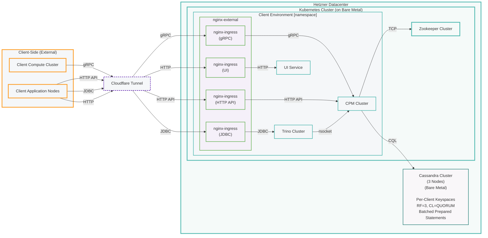

This document describes the current physical architecture for Cyoda Cloud's soft launch deployment, supporting **free tier** subscribers. The architecture provides a multi-tenant platform running on bare metal infrastructure in Hetzner datacenters, with isolated client environments and shared backend services.

This diagram shows the core components and data flow. Many operational elements are not depicted, including tunnel gateways, internal network/VPN infrastructure, Prometheus/Grafana monitoring, log aggregators, authentication services, AI Assistant app, Cloud Manager app, additional load balancers, and other supporting services.

## Cluster-Level Architecture

## Architecture Rules

### Components

The setup consists of:
- A Cassandra cluster (C*) - N nodes on bare metal (4+)
- Cyoda Processing Manager cluster (CPM) - containerized in Kubernetes
- Trino cluster (TSQL) - containerized in Kubernetes  
- Zookeeper cluster (ZK) - containerized in Kubernetes
- Client Compute cluster (CC) - external, client-operated
- Client Application Cluster (CA) - external, client-operated
- UI Service - containerized in Kubernetes
- nginx-ingress controllers - containerized in Kubernetes

### Infrastructure

**Cyoda Cloud Infrastructure:**
- CPM, TSQL, ZK, UI, and nginx-ingress run on Kubernetes cluster on bare metal in Hetzner datacenter
- C* runs directly on bare metal in Hetzner datacenter (outside Kubernetes)
- Each client environment operates within an isolated Kubernetes namespace
- Shared services (C*, ZK) serve multiple client environments

**Client Infrastructure:**
- CC and CA are external, client-operated clusters
- CC encapsulates client business logic for compute externalization
- CA hosts client applications consuming Cyoda services
- CA and CC may be physically the same runtime

### Data Storage

**Cassandra Configuration:**
- Per-client keyspaces for data isolation
- Replication factor = 3 across all nodes
- Consistency level = QUORUM for all operations
- All writes use batched prepared statements

### Network Connectivity

**Internal Connections:**
- CPM connects to C* via CQL for data persistence and querying
- CPM connects to ZK via TCP for cluster state management
- TSQL connects to CPM via rsocket for SQL query processing

**External Access:**
- All external access routes through Cloudflare tunnel
- Access is load-balanced through nginx-ingress controllers within each namespace
- CC connects to CPM via gRPC for compute externalization
- CA connects to CPM via HTTP API for application integration
- CA connects to TSQL via JDBC for SQL querying
- CA connects to UI via HTTP for web interface access

### Service Endpoints

**CPM Endpoints:**
- gRPC interface for high-performance compute externalization
- HTTP API for standard application integration (via HTTPS)

**TSQL Endpoints:**
- JDBC interface for SQL querying over flexible schemas

**UI Endpoints:**
- HTTP interface for web-based user interaction

### Access Control

External network access to Cyoda Cloud is exclusively via:
- Cloudflare tunnel as the single entry point
- nginx-ingress controllers providing protocol-specific load balancing
- No direct access to internal services bypassing the ingress layer

### Operational Responsibility

**Cyoda Cloud Operated:**
- CPM, TSQL, ZK, UI, nginx-ingress (Kubernetes workloads)
- C* (bare metal database cluster)
- All infrastructure within Hetzner datacenter

**Client Operated:**
- CC (compute externalization nodes)
- CA (application integration nodes)
- All external client infrastructure
