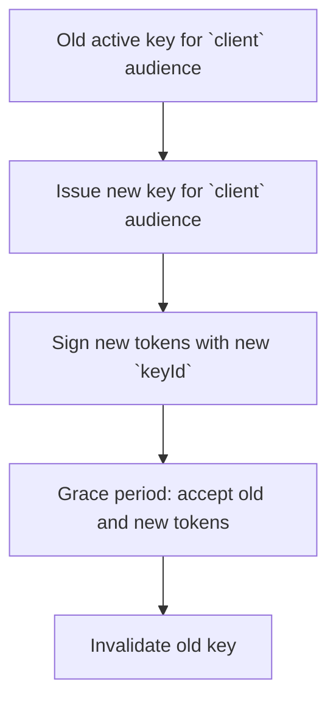
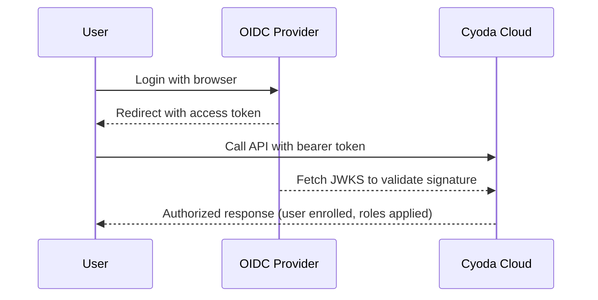

> This page covers identity operations for the **hosted Cyoda Cloud**
> platform. For self-hosted cyoda-go identity (OAuth 2.0 issuance,
> M2M credentials, external key trust on your own instance), see the
> [cyoda-go identity docs](https://github.com/Cyoda-platform/cyoda-go/blob/main/docs/).

## Overview

Cyoda Cloud authenticates users and technical clients via JWT access tokens. Tokens can be:

- Issued by Cyoda using internally managed asymmetric signing keys, for technical users (machine-to-machine API clients) and other scenarios where your own infrastructure needs to issue JWTs trusted by Cyoda.
- Issued by an external OpenID Connect (OIDC) provider that Cyoda is configured to trust, allowing you to use your own identity provider for regular and technical users, auto-enroll users from trusted JWT claims, and map IdP roles onto Cyoda authorities.

Once authenticated, what each identity can do on the platform is bounded by the subscription tier and its associated entitlements.

## Signing keys

Cyoda Cloud uses asymmetric JWT signing keys to issue and validate access tokens for technical users and custom integrations.

### JWT signing key attributes

Cyoda Cloud represents each signing key-pair with a set of attributes:

- **Audience (`audience`)**
  - Internal Cyoda concept that describes which consumers use tokens signed with this key. This is not the same as the JWT `aud` claim.
  - Typical values:
    - `human` – tokens issued for the regular users
    - `client` – tokens issued for technical users (machine-to-machine access)
- **Algorithm (`algorithm`)**
  - Asymmetric signing algorithms only (for example, `RS256`, `RS512`, `ES256`).
- **Validity window (`validFrom`, `validTo`)**
  - Optional `validFrom` and `validTo` define when a key becomes valid and when it expires.
- **Key ID (`keyId` / `kid`)**
  - Each key-pair has a unique `keyId`.
  - This value is included in the JWT header as the `kid` field.

In standard Cyoda Cloud, JWT signing keys for technical users are managed centrally by Cyoda. In custom or on-premise installations, it is also possible to configure an externally injected key-pair file that IAM uses instead of managing keys entirely through the API.

### Managing JWT signing keys

At a high level, you can do the following operations:

1. Create or rotate signing key-pairs for the relevant audience.
2. Invalidate the keys with a grace period and then reactivate them.
3. Delete the key-pairs completely.

#### Example: issue a key for technical users

The following example shows a minimal request for creating a key-pair for technical users:

```json
{
  "audience": "client",
  "algorithm": "RS256"
}
```

Your token issuer will receive the corresponding `keyId` and the public key. It should use the private key to sign access tokens for technical users and include the `kid` header in each JWT.

#### Example: rotate a key with grace period

To perform a safe rotation with a grace period for technical users:

1. Issue a new key-pair for the `client` audience if you don't have any.
2. Mark the old key as invalid but allow a grace period during which previously issued tokens remain valid, for example:

```json
{
  "gracePeriodSec": 3600
}
```

After the grace period expires, you can remove the old key or leave it invalidated.

#### End-to-end example: technical user using a rotated key

Putting it together for a typical environment:

1. **Before rotation**: Your technical user obtains access tokens signed with the old key (for example, `keyId = "old-key-id"`).
2. **Issue new key**: You create a new key for `audience = "client"` and obtain `keyId = "new-key-id"`.
3. **Switch issuer**: Token issuance logic starts using `"new-key-id"` to sign tokens while still accepting tokens with `"old-key-id"` during the grace period.
4. **Verify access**: Both old and new tokens can call Cyoda APIs until the grace period expires.
5. **Finalize rotation**: After the grace period, any remaining tokens signed with `"old-key-id"` are rejected, and you can clean up the old key.

**Key rotation flow**



### Key rotation recommendations

- Rotate keys regularly to limit the potential security risks.
- Separate user and technical-user token lifecycles in your application.
- In custom installations with externally injected key-pairs, align your rotation schedule with how often you replace the external key-pair files.

## OIDC provider configuration

When you register an OIDC provider in Cyoda Cloud, you describe how Cyoda should trust and use tokens from that provider.

Key concepts:

- **Well-known configuration URI**
  - The standard OIDC discovery endpoint exposed by your IdP (for example, `https://your-idp/.well-known/openid-configuration`).
  - Cyoda fetches the JWKS (public keys) and other metadata from this URL.
- **Issuers list**
  - An optional but strongly recommended list of allowed `iss` (issuer) values.
  - When present and non-empty, Cyoda requires the JWT `iss` claim to match one of these values.
  - When omitted or empty, issuer validation is skipped.
- **Provider state**
  - Providers can be active or inactive. Inactive providers are ignored during JWT validation, and any keys loaded for them are treated as untrusted.

In most environments, Cyoda Cloud comes pre-configured with providers for the supported identity options (for example, Auth0 for the default UI). Custom OIDC providers are typically used for enterprise integrations.

### How Cyoda uses OIDC providers

At a high level, Cyoda IAM uses configured OIDC providers to:

1. Validate the JWT signature and basic claims (for example, issuer or expiration).
2. Extract required claims that identify the user and their organization within the Cyoda instance.
3. Apply auto-enrollment logic:
   - Create a **user** record based on the token.
   - Create a **legal entity** record based on organization-related claims (allowed only in custom installations).
4. Build the authenticated principal with **authorities** derived from role-related claims.

The exact auto-enrollment behavior depends on how your environment is configured, but the required claims listed below must be present for the standard Cyoda Cloud flow to work.

### Configuring your custom OIDC provider

When configuring your IdP (for example, Auth0, Azure AD, or another OIDC provider) to work with Cyoda Cloud:

1. Ensure that access tokens issued for Cyoda APIs include at least:
   - `sub`
   - `org_id`
   - `caas_org_id`
2. Configure a claim (often via custom rules or mappers) that emits `user_roles` as an array of strings for users that need explicit roles.
3. Verify that the token `iss` (issuer) value matches one of the `issuers` configured for the corresponding OIDC provider in Cyoda.

### Operational tips

- Use a dedicated OIDC client/application configuration per environment (dev, test, prod) and reflect that in your `org_id` or `caas_org_id` values as appropriate.
- Keep the list of allowed `issuers` small and explicit to reduce the chance of accepting tokens from an unexpected issuer.
- When rotating keys at your IdP, you can trigger a reload of provider metadata (including JWKS) in Cyoda Cloud using the appropriate API.

### End-to-end example: custom OIDC provider

The following example describes a typical setup using an external OIDC provider as the IdP:

1. **Configure your application in the OIDC provider** representing your Cyoda environment.
2. **Create a rule or action** that adds the following claims to the access token when the audience matches your Cyoda App:
   - `sub` (OIDC provider user ID)
   - `org_id` (your external organization identifier)
   - `caas_org_id` (the Cyoda legal entity identifier for your installation - `your_user_id` for the single-user Cyoda instance)
3. **Register the OIDC provider in Cyoda Cloud** using the OIDC `.well-known/openid-configuration` URL and, optionally, the expected `iss` value.
4. **Test login** via the OIDC provider, obtain an access token, and call a Cyoda API endpoint. Cyoda Cloud validates the token and auto-enrolls the user under your legal entity if needed.



## JWT claims → role mapping

When integrating a **custom OIDC provider**, its access tokens must carry specific claims so that Cyoda Cloud can:

- Identify the user
- Identify the organization (legal entity)
- Map roles

The following table summarizes the claims used by the integration:

| Claim name | Type | Required? | Purpose |
|-----------|------|-----------|---------|
| `sub` | string | Yes | Standard OIDC subject. Used as a stable external user identifier. |
| `org_id` | string | Yes | External organization identifier provided by your IdP. Used as the legal entity external key and to build a human-readable name (for example, `"Org. <org_id>"`). |
| `caas_org_id` | string | Yes (for Cyoda-backed tenants) | Cyoda legal entity identifier (`caas_org_id`). Used as the `owner` of both users and legal entities. |
| `user_roles` | array of strings | Recommended | List of application or user roles. If absent, the user is treated as having no additional roles. |

## Entitlements

Access to Cyoda Cloud is subscription-tier-based. This section provides details about the available subscription tiers and their entitlements.

**Important**: The information below is for reference purposes and is not guaranteed to be correct. The authoritative source for your account's current subscription details and entitlements is available through the Cyoda Cloud API at the following endpoints:

- **Current account information**: `GET /account` — Retrieve information about the current user's account, including current subscription.
- **All available subscriptions**: `GET /account/subscriptions` — Retrieve all subscriptions available for the current user's legal entity.

For complete API documentation, refer to the [OpenAPI specification](/api-reference/).

### Subscription tiers overview

| Entitlement | Free<sup>1</sup> | Developer | Pro | Enterprise License<sup>2</sup> |
| --- | --- | --- | --- | --- |
| **Status** | <span style="background-color: #d4edda; color: #155724; padding: 2px 6px; border-radius: 3px;">Available</span> | <span style="background-color: #fff3cd; color: #856404; padding: 2px 6px; border-radius: 3px;">Draft</span> | <span style="background-color: #fff3cd; color: #856404; padding: 2px 6px; border-radius: 3px;">Draft</span> | <span style="background-color: #d4edda; color: #155724; padding: 2px 6px; border-radius: 3px;">Available</span> |
| **Model Fields (per model)** | 150 | <span style="color: #6c757d;">150</span> | <span style="color: #6c757d;">500</span> | Unlimited |
| **Model Fields (cumulative)** | 300 | <span style="color: #6c757d;">300</span> | <span style="color: #6c757d;">2000</span> | Unlimited |
| **Models** | 20 | <span style="color: #6c757d;">20</span> | <span style="color: #6c757d;">100</span> | Unlimited |
| **Client Nodes** | 1 | <span style="color: #6c757d;">1</span> | <span style="color: #6c757d;">5</span> | Unlimited |
| **Payload Size** | 5 MB | <span style="color: #6c757d;">5 MB</span> | <span style="color: #6c757d;">50 MB</span> | Unlimited |
| **Disk Usage** | 2 GB | <span style="color: #6c757d;">2 GB</span> | <span style="color: #6c757d;">1 TB</span> | Unlimited |
| **API Requests** | 300/min | <span style="color: #6c757d;">300/min</span> | <span style="color: #6c757d;">50/sec</span> | Unlimited |
| **External Calls** | 300/min | <span style="color: #6c757d;">300/min</span> | <span style="color: #6c757d;">50/sec</span> | Unlimited |

<sup>1</sup> _Free Tier environments are automatically reset after an expiry period. Contact us for details._
<sup>2</sup> _Enterprise License is for the Cyoda Cloud system that clients operate themselves (outside of Cyoda Cloud). Contact us for details._

**Status legend:**
- **Available**: Tier is currently available for subscription.
- **Draft (unavailable)**: Tier is in planning/development phase and not yet available.

### Entitlement definitions

The following section provides detailed definitions for each entitlement ID used in the subscription tiers:

| Entitlement ID | Description |
| --- | --- |
| `NUM_MODEL_FIELDS` | Maximum number of fields allowed per individual data model. This controls the complexity of each model you can create. |
| `NUM_MODEL_FIELDS_CUMULATIVE` | Total number of fields allowed across all data models in your account. This is the sum of fields across all your models. |
| `NUM_MODELS` | Maximum number of data models you can create in your account. Each model represents a different data structure or entity type. |
| `NUM_CLIENT_NODES` | Maximum number of client nodes that can connect to your Cyoda Cloud instance simultaneously. This controls concurrent compute capacity. |
| `PAYLOAD_SIZE` | Maximum size in bytes for individual API request payloads. This limits the amount of data you can send in a single API call. |
| `DISK_USAGE` | Maximum disk storage space allocated for your account data in bytes. This includes all stored models, data, and metadata. |
| `API_REQUEST` | Maximum number of API requests allowed per time interval. This controls the rate at which you can make API calls. |
| `EXTERNALIZED_CALL` | Maximum number of external compute calls allowed per time interval. This applies to calls made from your Cyoda Cloud instance to your connected compute nodes. |

---

_This subscription tier information is maintained in step with the platform configuration and may deviate from your actual settings. For the most current and accurate information about your specific account entitlements, please refer to the `/account` API endpoints._
