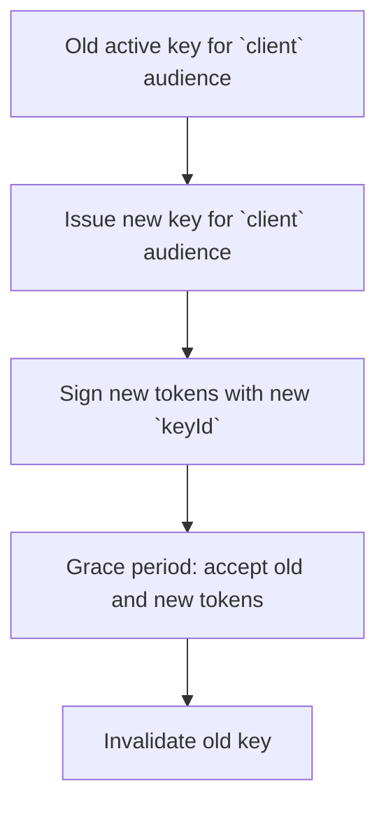

## Overview

Cyoda Cloud uses asymmetric JWT signing keys to issue and validate access tokens for:

- Technical users (machine-to-machine API clients)
- Other scenarios where your own infrastructure needs to issue JWTs trusted by Cyoda

This guide explains the basic attributes of JWT signing keys in Cyoda and shows how to manage keys rotation. 

## JWT Signing Key Attributes

Cyoda Cloud represents each signing key-pair with a set of attributes:

- **Audience (`audience`)**
  - Internal Cyoda concept that describes which consumers use tokens signed with this key. This is not the same as the JWT `aud` claim.
  - Typical values:
    - `human` – tokens issued for the regular users
    - `client` – tokens issued for technical users (machine-to-machine access)
- **Algorithm (`algorithm`)**
  - Asymmetric signing algorithms only (for example, `RS256`, `RS512`, `ES256`).
- **Validity window (`validFrom`, `validTo`)**
  - Optional `validFrom` and `validTo` define when a key becomes valid and when it expires.
- **Key ID (`keyId` / `kid`)**
  - Each key-pair has a unique `keyId`.
  - This value is included in the JWT header as the `kid` field.

In standard Cyoda Cloud, JWT signing keys for technical users are managed centrally by Cyoda. In custom or on-premise installations, it is also possible to configure an externally injected key-pair file that IAM uses instead of managing keys entirely through the API.

## Managing JWT Signing Keys

At a high level, you can do the following operations:

1. Create or rotate signing key-pairs for the relevant audience.
2. Invalidate the keys with a grace period and then reactivate them.
3. Delete the key-pairs completely.

### Example: Issue a Key for Technical Users

The following example shows a minimal request for creating a key-pair for technical users:

```json
{
  "audience": "client",
  "algorithm": "RS256"
}
```

Your token issuer will receive the corresponding `keyId` and the public key. It should use the private key to sign access tokens for technical users and include the `kid` header in each JWT.

### Example: Rotate a Key with Grace Period

To perform a safe rotation with a grace period for technical users:

1. Issue a new key-pair for the `client` audience if you don't have any.
2. Mark the old key as invalid but allow a grace period during which previously issued tokens remain valid, for example:

```json
{
  "gracePeriodSec": 3600
}
```

After the grace period expires, you can remove the old key or leave it invalidated.

### End-to-End Example: Technical User Using a Rotated Key

Putting it together for a typical environment:

1. **Before rotation**: Your technical user obtains access tokens signed with the old key (for example, `keyId = "old-key-id"`).
2. **Issue new key**: You create a new key for `audience = "client"` and obtain `keyId = "new-key-id"`.
3. **Switch issuer**: Token issuance logic starts using `"new-key-id"` to sign tokens while still accepting tokens with `"old-key-id"` during the grace period.
4. **Verify access**: Both old and new tokens can call Cyoda APIs until the grace period expires.
5. **Finalize rotation**: After the grace period, any remaining tokens signed with `"old-key-id"` are rejected, and you can clean up the old key.

**Key Rotation Flow**



## Key Rotation Recommendations

- Rotate keys regularly to limit the potential security risks.
- Separate user and technical-user token lifecycles in your application.
- In custom installations with externally injected key-pairs, align your rotation schedule with how often you replace the external key-pair files.


