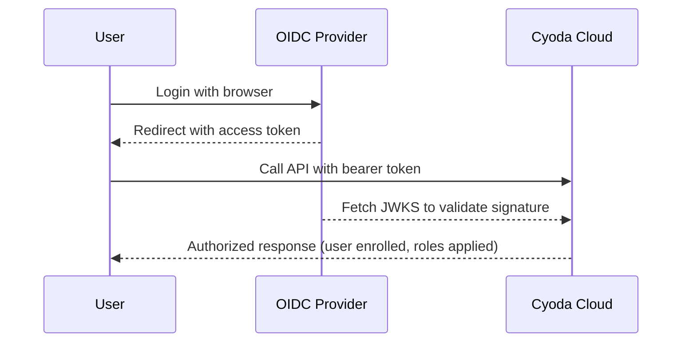

## Overview

Cyoda Cloud can accept JWT access tokens issued by external OpenID Connect (OIDC) providers. This allows you to:

- Use your own identity provider (IdP) to authenticate regular and technical users
- Automatically enroll users based on the trusted JWT claims
- Map IdP roles into Cyoda Cloud authorities

This guide explains the concepts behind OIDC provider configuration in Cyoda and the JWT claims that must be present for custom providers.

## OIDC Provider Concepts

When you register an OIDC provider in Cyoda Cloud, you describe how Cyoda should trust and use tokens from that provider.

Key concepts:

- **Well-known configuration URI**
  - The standard OIDC discovery endpoint exposed by your IdP (for example, `https://your-idp/.well-known/openid-configuration`).
  - Cyoda fetches the JWKS (public keys) and other metadata from this URL.
- **Issuers list**
  - An optional but strongly recommended list of allowed `iss` (issuer) values.
  - When present and non-empty, Cyoda requires the JWT `iss` claim to match one of these values.
  - When omitted or empty, issuer validation is skipped.
- **Provider state**
  - Providers can be active or inactive. Inactive providers are ignored during JWT validation, and any keys loaded for them are treated as untrusted.

In most environments, Cyoda Cloud comes pre-configured with providers for the supported identity options (for example, Auth0 for the default UI). Custom OIDC providers are typically used for enterprise integrations.

## How Cyoda Uses OIDC Providers

At a high level, Cyoda IAM uses configured OIDC providers to:

1. Validate the JWT signature and basic claims (for example, issuer or expiration).
2. Extract required claims that identify the user and their organization within Cyoda instance.
3. Apply auto-enrollment logic:
   - Create a **user** record based on the token.
   - Create a **legal entity** record based on organization-related claims (allowed only in custom installations).
4. Build the authenticated principal with **authorities** derived from role-related claims.

The exact auto-enrollment behavior depends on how your environment is configured, but the required claims listed below must be present for the standard Cyoda Cloud flow to work.

## Required JWT Claims for Custom OIDC Providers

When integrating a **custom OIDC provider**, its access tokens must carry specific claims so that Cyoda Cloud can:

- Identify the user
- Identify the organization (legal entity)
- Map roles

The following table summarizes the claims used by the integration:

| Claim name | Type | Required? | Purpose                                                                                                                                                                                |
|-----------|------|-----------|----------------------------------------------------------------------------------------------------------------------------------------------------------------------------------------|
| `sub` | string | Yes | Standard OIDC subject. Used as a stable external user identifier.                                                                                                                      |
| `org_id` | string | Yes | External organization identifier provided by your IdP. Used as the legal entity external key and to build a human-readable name (for example, `"Org. <org_id>"`).                      |
| `caas_org_id` | string | Yes (for Cyoda-backed tenants) | Cyoda legal entity identifier (`caas_org_id`). Used as the `owner` of both users and legal entities.                                                                                   |
| `user_roles` | array of strings | Recommended | List of application or user roles. If absent, the user is treated as having no additional roles. |

## Configuring Your Custom OIDC Provider

When configuring your IdP (for example, Auth0, Azure AD, or another OIDC provider) to work with Cyoda Cloud:

1. Ensure that access tokens issued for Cyoda APIs include at least:
   - `sub`
   - `org_id`
   - `caas_org_id`
2. Configure a claim (often via custom rules or mappers) that emits `user_roles` as an array of strings for users that need explicit roles.
3. Verify that the token `iss` (issuer) value matches one of the `issuers` configured for the corresponding OIDC provider in Cyoda.

## Operational Tips

- Use a dedicated OIDC client/application configuration per environment (dev, test, prod) and reflect that in your `org_id` or `caas_org_id` values as appropriate.
- Keep the list of allowed `issuers` small and explicit to reduce the chance of accepting tokens from an unexpected issuer.
- When rotating keys at your IdP, you can trigger a reload of provider metadata (including JWKS) in Cyoda Cloud using the appropriate API.

## End-to-End Example: Custom OIDC Provider

The following example describes a typical setup using external  OIDC Provider as the IdP:

1. **Configure your application in OIDC Provider** representing your Cyoda environment.
2. **Create a rule or action** that adds the following claims to the access token when the audience matches your Cyoda App:
   - `sub` (OIDC Provider user ID)
   - `org_id` (your external organization identifier)
   - `caas_org_id` (the Cyoda legal entity identifier for your installation - `your_user_id` for the single-user Cyoda instance)
3. **Register the OIDC provider in Cyoda Cloud** using the OIDC `.well-known/openid-configuration` URL and, optionally, the expected `iss` value.
4. **Test login** via OIDC Provider, obtain an access token, and call a Cyoda API endpoint. Cyoda Cloud validates the token, auto-enrolls the user under your legal entity if needed.

