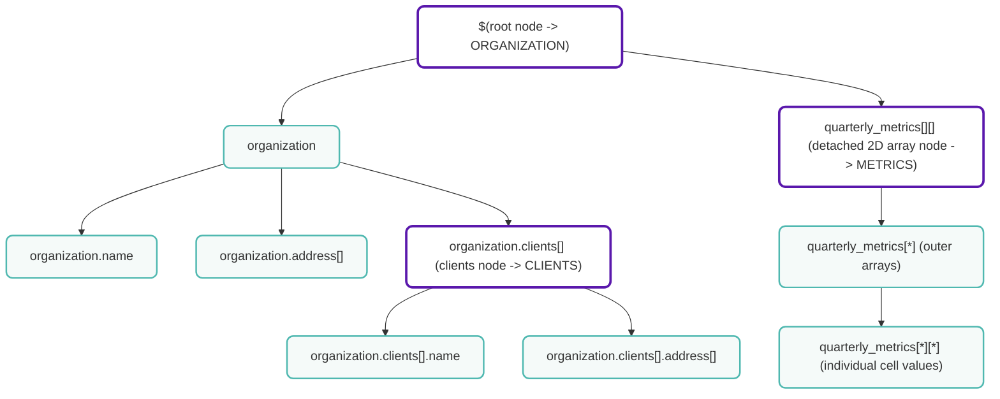

---
title: "SQL and Trino"
description: Learn how entities are mapped to SQL schemas and how to query with SQL
sidebar:
  order: 6
---

## Overview

This document explains how entities in Cyoda are represented as queryable SQL tables in Trino. Understanding this mapping will help you write effective SQL queries against your data.

## Core Concepts

Cyoda represents data (JSON/XML) as hierarchical tree structures. Internally, these trees are decomposed into a collection of `Nodes`, each capturing a specific branch or subset of the data. This decomposition provides a uniform representation for querying and traversal—whether through API-level path queries or via SQL through the Trino connector.

In the Trino view, each node is exposed as a **virtual SQL table**, allowing nested structures to be queried using familiar relational syntax without flattening the original hierarchy.

**Key principle**: Each `Node` corresponds to exactly ONE SQL table.

### Node Model

Each Node has:
- **path**: a string identifying the node’s position in the hierarchy (e.g. `$`, `$.organization.clients`, `$.agreement_data`)
- **fields**: A map of field names to values, where values can be:
    - Primitive types (string, number, boolean, date, etc.)
    - 1-dimensional arrays of primitives

The collection of these nodes forms the internal data model that underpins the Trino connector. The TreeNodeEntity is the object type that encapsulates this node collection when interacting with the Cyoda API, but it is a byproduct of this broader structural model rather than its defining feature.

### Node Creation Rules

Nodes are derived directly from the structure of the data (such as JSON/XML):

1. **Root Node**: Always created with path `$` containing top-level fields
2. **Array of Objects**: Each array of objects creates a new node
3. **Multidimensional Arrays**:  each dimension beyond one creates a further node to preserve structural depth

This consistent mapping enables Cyoda to represent, navigate, and query arbitrarily nested data structures in a predictable and composable way.


#### Example: Node Structure

Given a JSON file with these paths:
```
$.organization.name
$.organization.address[]
$.organization.clients[].name
$.organization.clients[].address[]
$.quarterly_metrics[][]
```

The system creates the following nodes:

**Node 1** (Root):
- Path: `$`
- Fields: `.organization.name`, `.organization.address[]`

**Node 2** (Clients array):
- Path: `$.organization.clients[*]`
- Fields: `.name`, `.address[]`

**Node 3** (Agreement data - 2D array, detached):
- Path: `$.quarterly_metrics[*]`
- Fields: `[*]` (detached array containing the inner array elements)
- This is a detached array because `agreement_data` is a 2-dimensional array


For example,
```json
{
  "organization": {
    "name": "Acme Corp",
    "address": [
      "123 Market Street",
      "Suite 400",
      "San Francisco, CA 94105"
    ],
    "clients": [
      {
        "name": "Client A",
        "address": ["10 First Ave", "Seattle, WA 98101"]
      },
      {
        "name": "Client B",
        "address": ["200 Second St", "Portland, OR 97204"]
      }
    ]
  },
  "quarterly_metrics": [
    [1000, 1200, 900, 1100],
    [1300, 1400, 1250, 1500]
  ]
}
```

### Tree Decomposition

Here is a visual representation of the node structure for the example above, where we have labelled the corresponding SQL tables as ORGANIZATION, CLIENTS, and METRICS:




### Embedded Arrays and Detached Arrays

When JSON/XML contains one-dimensional arrays of primitives within objects, the system does not create a separate node for such arrays. Instead they are represented as a single column of an array type. In the table it can be represented as a column of array type (i.e. `field_array` - ARRAY[STRING]) or as multiple columns (i.e. `field_0` - STRING, `field_1` - STRING, ...), depending on the `flatten_array` flag for this field in the trino schema settings. That setting also works for system fields, such as `index`.

When JSON/XML contains multidimensional arrays (arrays of arrays), the system creates separate nodes for each dimension after the first. This process is called **array detachment**.

#### Understanding Detached Arrays

A **detached array** is created when an array contains other arrays as elements. Each additional dimension becomes a separate node with its own table.

The primary motivation behind this approach is that if a JSON contains a table-like structure, i.e. a 2-dimensional array of primitives - it should be represented as a table in Trino. This logic then was extended and generalized to work for arrays of any number of dimensions, that is larger than 1.

#### Example 1: Simple 2D Array

Consider this JSON with a 2-dimensional array:

```json
{
  "matrix": [
    [1, 2, 3],
    [4, 5, 6]
  ]
}
```

**Nodes created:**

**Node 1** (Root - `$`):
- Path: `$`
- Fields: (none - the matrix field is an array of arrays, so it's not stored here)

**Node 2** (First dimension - `$.matrix[*]`):
- Path: `$.matrix[*]`
- Fields: `[1]`, `[2]`, `[3]` (those are detached array fields containing values from the inner arrays, which are represented as rows)
- This node is marked as having a detached array

**Generated Tables:**

**Table 1: `mydata`** (from node `$`)
- Contains only special and root columns (no data fields in this case)

**Table 2: `mydata_matrix_array`** (from node `$.matrix[*]` - detached array)
- Table name breakdown:
    - `mydata` = entity name
    - `_matrix` = field name from path
    - `_array` = suffix indicating this is a detached array table
- Columns:
    - `entity_id` (UUID)
    - `point_time` (DATE)
    - Root columns (creation_date, last_update_date, state)
    - `index_0` (INTEGER) - Position in the outer array (0 or 1 in this example)
    - `element_0`, `element_1`, `element_2` (INTEGER) - The three elements of each inner array

#### Example 2: 3D Array

For a 3-dimensional array:

```json
{
  "cube": [
    [[1, 2], [3, 4]],
    [[5, 6], [7, 8]]
  ]
}
```

**Nodes created:**

**Node 1** (Root - `$`):
- No data fields

**Node 2** (Second dimension - `$.cube[*][*]`, no separate layer for the first dimension in this case):
- Fields: `[1]`, `[2]`, `[3]`

**Generated Tables:**

**Table 1: `mydata`** (from node `$`)

**Table 2: `mydata_cube_2d_array`** (from node `$.cube[*][*]`. Note that `2d` in this case represents the amount of collapsed dimensions, while the 3rd dimension is detached)

- Columns include `index_0` and `index_1` for positions in both dimensions
- `element_0`, `element_1` for the two primitive values

#### Example 3: Array of Objects with Nested Arrays

```json
{
  "data": [
    {
      "name": "item1",
      "values": [10, 20, 30]
    },
    {
      "name": "item2",
      "values": [40, 50]
    }
  ]
}
```

**Nodes created:**

**Node 1** (Root - `$`):
- Path: `$`

**Node 2** (Array of objects - `$.data[*]`):
- Path: `$.data[*]`
- Fields: `.name`, `.values[]`

**Generated Tables:**

**Table 1: `mydata`** (from node `$`)

**Table 2: `mydata_data`** (from node `$.data[*]`)
- Columns:
    - Special and root columns
    - `index_0` (INTEGER) - Position in the data array
    - `name` (STRING) - From `.name` field
    - `values_array` (ARRAY[INTEGER]) or `values_0`, `values_1`, `values_2` (INTEGER) depending on the flag `flatten_array` for this field in the trino schema settings

#### Variable Dimension Arrays (Mixed Depths)

The system can handle arrays where elements have different nesting depths - some elements are primitives while others are arrays.

**Example:**

```json
{
  "data": [
    1,
    [2, 3],
    [4, 5, [6, 7], [8, 9]]
  ]
}
```

This is a **polymorphic array** containing:
- A primitive value: `1`
- A 1-dimensional array: `[2, 3]`
- A 2-dimensional array: `[4, 5, [6, 7], [8, 9]]`


**Nodes created:**

**Node 1** (Root - `$`)

**Node 2** (Mixed node - `$.data[*]`)

**Node 3** (Mixed node - `$.data[*][*]`)


**Generated Tables:**

**Table 1: `mydata`** (from node `$`)
- Columns:
    - Special and root columns
    - `data[*]` (ARRAY[INTEGER]) - Field for the top-level array elements (one row with array value `[1]` for the current example)

**Table 2: `mydata_data_array`** (from node `$.data[*]`)
- Contains rows for second-level array elements (2 rows for the current examle)
- Columns:
    - Special and root columns
    - `index_0` (INTEGER) - Position in the data array
    - `element_0`, `element_1` - columns for primitive values at the second level. (For values `2`,`3`,`4`,`5` presented in 2 rows)

**Table 3: `mydata_data_2d_array`** (from array part of `$.data[*][*]`)
- Contains the elements from nested arrays
- Columns:
    - Special and root columns
    - `index_0`, `index_1` (INTEGER) - Position in the outer array
    - `element_0`, `element_1`, - Elements from the third level arrays (For values `6`,`7`,`8`,`9` presented in 2 rows. Index values for those rows would be `2,2`, `2,3`)

---

## SQL Table Generation

### Table Naming Convention

**Important**: Each node in your TreeNodeEntity is mapped to exactly ONE SQL table

Table names are generated using the following rules:

1. **Base name**: Entity model name (e.g., `prizes`, `companies_details`)
2. **Version suffix** (if version > 1): `_<version>` (e.g., `_2`, `_3`)
3. **Path suffix** (for non-root nodes): Derived from the node path with `.` and `#` replaced by `_`
    - Example: `$.prizes[*]` → `_prizes`
    - Example: `$.prizes[*].laureates[*]` → `_prizes_laureates`
4. **Multidimensional suffix**: `_<N>d` where N is the number of `][` sequences in the *node path* + 1 (Note that such naming element is derived from the node path, not the field path (represents the number of collapsed dimensions), so if we are dealing with 3-dimensional array of primitives, the suffix will be `_2d`, as the last dimension is expanded into columns)
    - Example: `$.data[*][*]` has one `][` → `_2d`
    - Example: `$.cube[*][*][*]` has two `][` → `_3d`
5. **Detached array suffix**: `_array` added when the node represents a detached array
    - This happens for multidimensional arrays where inner dimensions are "detached"

#### Table Naming Examples

| Entity Name | Version | Node Path | Is Detached Array? | Table Name | Explanation |
|-------------|---------|-----------|-------------------|------------|-------------|
| `prizes` | 1 | `$` | No | `prizes` | Root node |
| `prizes` | 2 | `$` | No | `prizes_2` | Root node, version 2 |
| `prizes` | 1 | `$.prizes[*]` | No | `prizes_prizes` | Array of objects |
| `prizes` | 1 | `$.prizes[*].laureates[*]` | No | `prizes_prizes_laureates` | Nested array of objects |
| `companies` | 1 | `$.matrix[*]` | Yes | `companies_matrix_array` | 2D array - detached |
| `companies` | 1 | `$.cube[*][*]` | Yes | `companies_cube_2d_array` | 3D array - has `][` so gets `_2d`, plus `_array` |

**Note** that this is default schema generation naming and all these names can be changed manually in the schema settings.

### Special JSON Table

In addition to the structured tables, every entity model gets a special **JSON table** that contains the complete reconstructed JSON for each entity:

- **Table name**: `<entity_name>_json` (e.g., `prizes_json`)
- **Purpose**: Allows you to retrieve the full original JSON document

**⚠️ IMPORTANT PERFORMANCE NOTE**: When querying the JSON table, **always include the `entity_id` in your WHERE clause** for optimal performance. Without this condition, the query may be significantly slower, especially with large datasets.

**Good practice:**
```sql
SELECT entity FROM prizes_json WHERE entity_id = '<uuid>';
```

**Avoid:**
```sql
SELECT entity FROM prizes_json;  -- This will be slow!
```

---

## Table Columns

Every SQL table contains several categories of columns:

### 1. Special Columns

These are system-generated columns available in all tables:

| Column Name | Data Type | Description |
|-------------|-----------|-------------|
| `entity_id` | UUID | Unique identifier for the entity (the loaded JSON/XML file) |
| `point_time` | DATE | Allows querying data as it existed at a specific point in time |

**Note**: The JSON table also includes:
- `entity` (STRING): The complete reconstructed JSON document

### 2. Root Columns

These columns provide metadata about the entity:

| Column Name | Source Field | Data Type | Description |
|-------------|--------------|-----------|-------------|
| `creation_date` | `creationDate` | DATE | When the entity was created in the system |
| `last_update_date` | `lastUpdateTime` | DATE | When the entity was last modified |
| `state` | `state` | STRING | Current workflow state of the entity |

### 3. Index Columns

For tables representing array (object or detached) elements (depth > 0), an `index` column is provided:

- **Column name**: `index`
- **Purpose**: Identifies the position of this row in the array hierarchy
- **Structure**: Can be flattened into individual columns (`index_0`, `index_1`, etc.) for multidimensional arrays. Is flattened by default

**Example**: For `$.prizes[*].laureates[*]`:
- `index_0`: Position in the `prizes` array
- `index_1`: Position in the `laureates` array within that prize

### 4. Data Columns

These are the actual fields from your JSON/XML data.

#### Primitive Fields

Simple fields are mapped directly to columns:

| JSON Path | Field Key | Column Name | Data Type |
|-----------|-----------|-------------|-----------|
| `$.organization.name` | `.organization.name` | `organization_name` | STRING |
| `$.prizes[*].year` | `.year` | `year` | STRING |
| `$.prizes[*].laureates[*].id` | `.id` | `id` | STRING |

**Naming rules**:
- Leading `.` is removed from the field key
- Reserved field names (like `index`) are prefixed with `_` (e.g., `_index`)

#### Array Fields

1-dimensional arrays of primitives are handled in two ways:

**Option 1: Array Column** (default for homogeneous arrays)
- Column name: `<field_name>_array`
- Data type: `ARRAY[<element_type>]`
- Example: `.addresses[]` → `addresses_array` (ARRAY[STRING])

**Option 2: Flattened Columns** (for multi-type or ZONED_DATE_TIME arrays)
- Multiple columns created: `<field_name>_0`, `<field_name>_1`, etc.
- Each column represents one position in the array
- Example: `.scores[]` → `scores_0`, `scores_1`, `scores_2` (if array has 3 elements)

---

## Supported Data Types

The system supports the following data types, which are mapped to appropriate SQL types for Trino queries. Understanding how these types are detected from JSON is crucial for working with your data effectively.

**Important**: All data is stored internally in Cyoda with full precision. Trino provides a SQL query interface to this data, and some types (like UNBOUND_DECIMAL and UNBOUND_INTEGER) are represented as strings in Trino due to Trino's numeric limitations, even though they are stored as numbers in Cyoda.

### Data Type Reference Table

| System Type | SQL Type | Description | JSON Detection |
|-------------|----------|-------------|----------------|
| STRING | VARCHAR | Text data (max 1024 characters) | Text values, or values that can't be parsed as other types |
| CHAR | CHAR | Single character | Single-character strings |
| BYTE | TINYINT | 8-bit integer (-128 to 127) | Integers in byte range |
| SHORT | SMALLINT | 16-bit integer (-32,768 to 32,767) | Integers in short range |
| INT | INTEGER | 32-bit integer | Integers in int range |
| LONG | BIGINT | 64-bit integer | Integers in long range |
| FLOAT | REAL | Single-precision floating point | Decimals with ≤6 digits precision and scale ≤31 |
| DOUBLE | DOUBLE | Double-precision floating point | Decimals with ≤15 digits precision and scale ≤292 |
| BIG_DECIMAL | DECIMAL(38,18) | High-precision decimal (Trino Int128) | Decimals that fit in Int128 with scale ≤18 |
| UNBOUND_DECIMAL | VARCHAR | Very large/precise decimals (Trino representation) | Decimals exceeding BIG_DECIMAL limits |
| BIG_INTEGER | DECIMAL(38,0) | Large integer (Trino Int128) | Integers that fit in Int128 range |
| UNBOUND_INTEGER | VARCHAR | Very large integers (Trino representation) | Integers exceeding BIG_INTEGER limits |
| BOOLEAN | BOOLEAN | True/false values | JSON boolean values |
| LOCAL_DATE | DATE | Date without time | ISO date strings (e.g., "2024-01-15") |
| LOCAL_TIME | TIME | Time without date | ISO time strings (e.g., "14:30:00") |
| LOCAL_DATE_TIME | TIMESTAMP | Date and time without timezone | ISO datetime strings |
| ZONED_DATE_TIME | TIMESTAMP WITH TIME ZONE | Date and time with timezone | ISO datetime with timezone |
| UUID | UUID | Universally unique identifier | Valid UUID strings |
| TIME_UUID | UUID | Time-based UUID (version 1) | UUID version 1 strings |
| BYTE_ARRAY | VARBINARY | Binary data | Base64-encoded strings |

### How Number Types Are Detected from JSON

When the system parses JSON numbers, it follows a specific detection algorithm to determine the most appropriate type:

#### Integer Detection

For whole numbers (no decimal point), the system checks in this order:

1. **BYTE** - If the value is between -128 and 127
2. **SHORT** - If the value is between -32,768 and 32,767
3. **INT** - If the value is between -2,147,483,648 and 2,147,483,647
4. **LONG** - If the value is between -9,223,372,036,854,775,808 and 9,223,372,036,854,775,807
5. **BIG_INTEGER** - If the value fits in Int128 range (see below)
6. **UNBOUND_INTEGER** - For integers larger than Int128

**Example:**
```json
{
  "small": 42,           // → BYTE
  "medium": 1000,        // → SHORT
  "large": 100000,       // → INT
  "veryLarge": 10000000000,  // → LONG
  "huge": 123456789012345678901234567890  // → BIG_INTEGER or UNBOUND_INTEGER
}
```

#### Decimal Detection

For numbers with decimal points, the system checks in this order:

1. **FLOAT** - If precision ≤ 6 digits and scale is between -31 and 31
2. **DOUBLE** - If precision ≤ 15 digits and scale is between -292 and 292
3. **BIG_DECIMAL** - If the value fits in Int128 decimal constraints (see below)
4. **UNBOUND_DECIMAL** - For decimals exceeding BIG_DECIMAL limits

**Example:**
```json
{
  "price": 19.99,                    // → FLOAT (6 digits precision)
  "precise": 123.456789012345,       // → DOUBLE (15 digits precision)
  "veryPrecise": 123456789012345.123456789012345,  // → BIG_DECIMAL
  "extremelyPrecise": 1.23456789012345678901234567890123456789  // → UNBOUND_DECIMAL
}
```

### Understanding BIG_DECIMAL and UNBOUND_DECIMAL

#### BIG_DECIMAL (Trino Int128 Decimal)

**BIG_DECIMAL** is bounded by Trino's maximum numeric capacity, which uses a 128-bit integer (Int128) with a **fixed scale of 18**.

**Constraints:**
- **Scale**: Must be ≤ 18 decimal places
- **Precision**: Must be ≤ 38 total digits (with some complexity - see below)
- **Range**: Approximately ±170,141,183,460,469,231,731.687303715884105727

**Detailed Precision Rules:**

The system uses two precision checks:
1. **Strict check**: `precision ≤ 38` AND `exponent ≤ 20` (where exponent = precision - scale)
2. **Loose check**: `precision ≤ 39` AND `exponent ≤ 21` AND the value fits when scaled to 18 decimal places

**Examples:**
```json
{
  "fits": 12345678901234567890.123456789012345678,     // ✓ BIG_DECIMAL (38 digits, scale 18)
  "tooManyDecimals": 123.1234567890123456789,          // ✗ UNBOUND_DECIMAL (scale > 18)
  "tooLarge": 999999999999999999999.999999999999999999 // ✗ UNBOUND_DECIMAL (exceeds Int128)
}
```

#### UNBOUND_DECIMAL

**UNBOUND_DECIMAL** is used for decimal values that exceed Trino's numeric representation limits.

**Storage vs Representation:**
- **In Cyoda**: Stored as full-precision BigDecimal numbers with all numeric operations available in workflows
- **In Trino SQL**: Represented as VARCHAR (strings) due to Trino's Int128 limitations

**When a decimal becomes UNBOUND_DECIMAL:**
- Scale > 18 decimal places
- Total value exceeds Int128 range
- Precision and exponent exceed the limits

**Important for SQL Queries**: When querying UNBOUND_DECIMAL columns in Trino, you must treat them as VARCHAR, not as numeric types. Numeric operations are not available in SQL queries for these fields.

```sql
-- Correct: Treat as string in Trino SQL
SELECT * FROM mytable WHERE unbound_decimal_field = '123.12345678901234567890123456789';

-- Incorrect: Cannot use numeric operations in Trino SQL
SELECT * FROM mytable WHERE unbound_decimal_field > 100;  -- This will fail!

-- Note: Numeric operations ARE available in Cyoda workflows, just not in Trino SQL queries
```

### Understanding BIG_INTEGER and UNBOUND_INTEGER

#### BIG_INTEGER (Trino Int128)

**BIG_INTEGER** is bounded by Trino's 128-bit integer capacity.

**Constraints:**
- **Range**: -170,141,183,460,469,231,731,687,303,715,884,105,728 to 170,141,183,460,469,231,731,687,303,715,884,105,727
- This is 2^127 - 1 for the maximum and -2^127 for the minimum

**Examples:**
```json
{
  "fits": 123456789012345678901234567890,              // ✓ BIG_INTEGER (within Int128)
  "tooLarge": 999999999999999999999999999999999999999  // ✗ UNBOUND_INTEGER (exceeds Int128)
}
```

#### UNBOUND_INTEGER

**UNBOUND_INTEGER** is used for integer values that exceed the Int128 range.

**Storage vs Representation:**
- **In Cyoda**: Stored as full-precision BigInteger numbers with all numeric operations available in workflows
- **In Trino SQL**: Represented as VARCHAR (strings) due to Trino's Int128 limitations

**Important for SQL Queries**: When querying UNBOUND_INTEGER columns in Trino, you must treat them as VARCHAR. Numeric operations are not available in SQL queries for these fields.

```sql
-- Correct: Treat as string in Trino SQL
SELECT * FROM mytable WHERE unbound_integer_field = '999999999999999999999999999999999999999';

-- Incorrect: Cannot use numeric operations in Trino SQL
SELECT * FROM mytable WHERE unbound_integer_field > 1000;  -- This will fail!

-- Note: Numeric operations ARE available in Cyoda workflows, just not in Trino SQL queries
```

### Type Detection Priority

When parsing JSON, the system always tries to use the **most specific type** that fits the value:

1. **Smallest integer type** that can hold the value (BYTE → SHORT → INT → LONG → BIG_INTEGER → UNBOUND_INTEGER)
2. **Smallest decimal type** that can hold the value (FLOAT → DOUBLE → BIG_DECIMAL → UNBOUND_DECIMAL)
3. **STRING** as a fallback for any value that can't be parsed as a more specific type

### String Parsing

When a JSON value is a string, the system attempts to parse it as other types in this priority order:

1. **Temporal types** (dates, times, datetimes)
2. **UUID types**
3. **Boolean** ("true" or "false")
4. **Numeric types** (if the string contains a valid number)
5. **STRING** (if none of the above match)

**Example:**
```json
{
  "date": "2024-01-15",                    // → LOCAL_DATE
  "uuid": "550e8400-e29b-41d4-a716-446655440000",  // → UUID
  "bool": "true",                          // → BOOLEAN
  "text": "hello world"                    // → STRING
}
```

---

## Polymorphic Fields

### What Are Polymorphic Fields?

A **polymorphic field** occurs when the same field path has different data types across different elements in your JSON/XML data. This commonly happens in arrays of objects where the same field name contains different types of values.

### Example of Polymorphic Data

```json
{
  "items": [
    { "value": "text string" },
    { "value": 123 },
    { "value": 45.67 }
  ]
}
```

In this example, the field `$.items[*].value` is polymorphic because it contains:
- A STRING in the first element
- An INTEGER in the second element
- A DOUBLE in the third element

### How Polymorphic Fields Are Handled

When the system detects polymorphic fields, it automatically determines a **common data type** that can accommodate all the different types encountered. The system uses the following logic:

1. **Check for compatible types**: The system first checks if all types are compatible and can be converted to a common type
2. **Find the lowest common denominator**: It selects the most general type that all values can be converted to
3. **Fall back to STRING**: If no common numeric or date type exists, the field is stored as STRING

### Type Compatibility Rules

The system recognizes certain types as compatible and will convert them to a common type using **widening conversions**. The system always chooses the type that can represent all values without loss of information.

#### Numeric Type Hierarchy

**Integer types** (from smallest to largest):
- BYTE → SHORT → INT → LONG → BIG_INTEGER → UNBOUND_INTEGER

**Decimal types** (from smallest to largest):
- FLOAT → DOUBLE → BIG_DECIMAL → UNBOUND_DECIMAL

**Cross-hierarchy conversions**:
- Any integer type can widen to any larger integer type or any decimal type
- Any decimal type can widen to a larger decimal type
- UNBOUND_DECIMAL is the widest numeric type (can hold any number)

#### Common Type Conversion Examples

| Types Found | Common Type Used | Explanation |
|-------------|------------------|-------------|
| BYTE, SHORT | SHORT | Wider integer type |
| INT, LONG | LONG | Wider integer type |
| BYTE, DOUBLE | DOUBLE | Integer widens to decimal |
| INT, BIG_DECIMAL | BIG_DECIMAL | Integer widens to decimal |
| LONG, UNBOUND_INTEGER | UNBOUND_INTEGER | Wider integer type |
| FLOAT, DOUBLE | DOUBLE | Wider decimal type |
| DOUBLE, BIG_DECIMAL | UNBOUND_DECIMAL | DOUBLE can't fit in BIG_DECIMAL's fixed scale |
| BIG_INTEGER, BIG_DECIMAL | BIG_DECIMAL | Integer widens to decimal |
| BIG_DECIMAL, UNBOUND_DECIMAL | UNBOUND_DECIMAL | Wider decimal type |
| BIG_INTEGER, UNBOUND_INTEGER | UNBOUND_INTEGER | Wider integer type |
| Any numeric, STRING | STRING | Incompatible - falls back to STRING |
| BOOLEAN, INT | STRING | Incompatible - falls back to STRING |
| UUID, STRING | STRING | Incompatible - falls back to STRING |

#### Temporal Type Conversions

Temporal types have a resolution hierarchy, where lower-resolution types (like YEAR) can be converted to higher-resolution types (like LOCAL_DATE) by adding default values for the missing components.

**Resolution Hierarchy:**
- YEAR → YEAR_MONTH → LOCAL_DATE → LOCAL_DATE_TIME → ZONED_DATE_TIME
- LOCAL_TIME → LOCAL_DATE_TIME → ZONED_DATE_TIME

**Important Note:** The LOCAL_DATE_TIME and ZONED_DATE_TIME types are considered incompatible with each other, because of type detection ambiguity. Since any of this type can be parsed as the other, such polymorphism cannot occur automatically.

When polymorphic temporal fields are detected, the system converts all values to the highest resolution type found.

##### Upscaling (Low Resolution → High Resolution)

When converting from a lower-resolution type to a higher-resolution type, the system adds default values for the missing components:

| From Type | To Type | Conversion Rule | Example |
|-----------|---------|-----------------|---------|
| YEAR | YEAR_MONTH | Add month = 1 (January) | `2024` → `2024-01` |
| YEAR_MONTH | LOCAL_DATE | Add day = 1 (first day of month) | `2024-01` → `2024-01-01` |
| LOCAL_DATE | LOCAL_DATE_TIME | Add time = 00:00:00 (midnight) | `2024-01-01` → `2024-01-01T00:00:00` |
| LOCAL_TIME | LOCAL_DATE_TIME | Add date = 1970-01-01 (epoch) | `14:30:00` → `1970-01-01T14:30:00` |


**Multi-step Conversions:**

The system can perform multi-step conversions by chaining the rules above:

- **YEAR → LOCAL_DATE**: `2024` → `2024-01` → `2024-01-01`
- **YEAR → LOCAL_DATE_TIME**: `2024` → `2024-01` → `2024-01-01` → `2024-01-01T00:00:00`
- **YEAR_MONTH → LOCAL_DATE_TIME**: `2024-06` → `2024-06-01` → `2024-06-01T00:00:00`

##### Downscaling (High Resolution → Low Resolution)

When converting from a higher-resolution type to a lower-resolution type, the system truncates the extra precision:

| From Type | To Type | Conversion Rule | Example |
|-----------|---------|-----------------|---------|
| YEAR_MONTH | YEAR | Extract year only | `2024-06` → `2024` |
| LOCAL_DATE | YEAR_MONTH | Extract year and month | `2024-06-15` → `2024-06` |
| LOCAL_DATE_TIME | LOCAL_DATE | Extract date part | `2024-06-15T14:30:00` → `2024-06-15` |
| LOCAL_DATE_TIME | LOCAL_TIME | Extract time part | `2024-06-15T14:30:00` → `14:30:00` |

**Note**: Downscaling is primarily used internally for query optimization (i.e. when processing a query condition for [YEAR, DATE] polymorphic field, we will downscale the query condition to YEAR for the YEAR part of the target field). In polymorphic fields, represented in Trino, the system always upscales to the highest resolution type.

##### Polymorphic Temporal Field Examples

**Example 1: Mixed Date Resolutions**
```json
{
  "events": [
    { "date": "2024" },              // YEAR
    { "date": "2024-06" },           // YEAR_MONTH
    { "date": "2024-06-15" }         // LOCAL_DATE
  ]
}
```

The field `$.events[*].date` is polymorphic with types: YEAR, YEAR_MONTH, LOCAL_DATE.

**Common type**: LOCAL_DATE (highest resolution)

**Trino SQL values after conversion**:
- `"2024"` → `2024-01-01` (January 1st, 2024)
- `"2024-06"` → `2024-06-01` (June 1st, 2024)
- `"2024-06-15"` → `2024-06-15` (unchanged)

**Example 2: Date and DateTime Mix**
```json
{
  "timestamps": [
    { "when": "2024-01-15" },                    // LOCAL_DATE
    { "when": "2024-01-15T14:30:00" }            // LOCAL_DATE_TIME
  ]
}
```

**Common type**: LOCAL_DATE_TIME

**Trino SQL values after conversion**:
- `"2024-01-15"` → `2024-01-15T00:00:00` (midnight)
- `"2024-01-15T14:30:00"` → `2024-01-15T14:30:00` (unchanged)

**Example 3: Time and DateTime Mix**
```json
{
  "schedule": [
    { "time": "14:30:00" },                      // LOCAL_TIME
    { "time": "2024-01-15T14:30:00" }            // LOCAL_DATE_TIME
  ]
}
```

**Common type**: LOCAL_DATE_TIME

**Trino SQL values after conversion**:
- `"14:30:00"` → `1970-01-01T14:30:00` (epoch date + time)
- `"2024-01-15T14:30:00"` → `2024-01-15T14:30:00` (unchanged)

##### Important Considerations for Temporal Polymorphism

1. **Default Values Matter**: When YEAR is converted to LOCAL_DATE, it becomes January 1st. This means:
   ```sql
   -- If the field contains polymorphic YEAR and LOCAL_DATE values
   SELECT * FROM events WHERE date = '2024-01-01'
   -- This will match both "2024" (converted to 2024-01-01) and "2024-01-01"
   ```

2. **Loss of Semantic Meaning**: A YEAR value of `"2024"` represents the entire year, but when converted to LOCAL_DATE it becomes `2024-01-01`, which represents a specific day. The original semantic meaning (entire year) is lost.

3. **Query Implications**: When querying polymorphic temporal fields, be aware of the conversion rules:
   ```sql
   -- Original data: ["2024", "2024-06-15"]
   -- Stored as LOCAL_DATE: [2024-01-01, 2024-06-15]

   -- This query will NOT match the original "2024" value
   SELECT * FROM events WHERE date >= '2024-06-15'

   -- Because "2024" was converted to 2024-01-01, and does not inclued every day of the year
   ```

4. **Best Practice**: If you need to preserve the original resolution, consider using separate fields:
   ```json
   {
     "yearOnly": "2024",
     "exactDate": "2024-06-15"
   }
   ```

##### Polymorphic Temporal Conversion Summary

**Common Polymorphic Combinations:**

| Types Found | Common Type | Conversion Applied |
|-------------|-------------|-------------------|
| YEAR, YEAR_MONTH | YEAR_MONTH | YEAR → YEAR_MONTH (add month=1) |
| YEAR, LOCAL_DATE | LOCAL_DATE | YEAR → YEAR_MONTH → LOCAL_DATE |
| YEAR_MONTH, LOCAL_DATE | LOCAL_DATE | YEAR_MONTH → LOCAL_DATE (add day=1) |
| LOCAL_DATE, LOCAL_DATE_TIME | LOCAL_DATE_TIME | LOCAL_DATE → LOCAL_DATE_TIME (add time=00:00:00) |
| LOCAL_TIME, LOCAL_DATE_TIME | LOCAL_DATE_TIME | LOCAL_TIME → LOCAL_DATE_TIME (add date=1970-01-01) |
|

### Important Notes

**Type Conversion**: When a polymorphic field is stored as a common type (e.g., STRING), all values are converted to that type. This means:
- Numeric values may be stored as strings: `"123"` instead of `123`
- You may need to cast values in your SQL queries: `CAST(value AS INTEGER)`


### Best Practices for Polymorphic Data

1. **Consistent typing**: When possible, maintain consistent data types for the same field across all array elements
2. **Explicit casting**: When querying polymorphic fields, that were converted to STRING, use explicit CAST operations with caution, as there are probably exist values that cannot be cast.
3. **Understand your data**: Use the schema inspection API to see which fields are polymorphic and what their common type is
4. **Consider restructuring**: If you have control over the data structure, consider using different field names for different types

---

## Complete Example

### Input JSON saved in system into model named "prizes" version 1

```json
{
  "extraction-date": "2024-01-15",
  "prizes": [
    {
      "year": "2023",
      "category": "Physics",
      "laureates": [
        {
          "id": "1001",
          "firstname": "Anne",
          "surname": "L'Huillier",
          "motivation": "for experimental methods...",
          "share": 3
        },
        {
          "id": "1002",
          "firstname": "Pierre",
          "surname": "Agostini",
          "motivation": "for experimental methods...",
          "share": 3
        }
      ]
    }
  ]
}
```

### Generated Tables

#### Table 1: `prizes` (Root node: `$`)

| Column Name | Data Type | Category | Description |
|-------------|-----------|----------|-------------|
| `entity_id` | UUID | SPECIAL | Entity identifier |
| `point_time` | DATE | SPECIAL | Query time point |
| `creation_date` | DATE | ROOT | Entity creation date |
| `last_update_date` | DATE | ROOT | Entity last update |
| `state` | STRING | ROOT | Entity state |
| `extraction_date` | DATE | DATA | From `.extraction-date` |

#### Table 2: `prizes_prizes` (Node: `$.prizes[*]`)

| Column Name | Data Type | Category | Description |
|-------------|-----------|----------|-------------|
| `entity_id` | UUID | SPECIAL | Entity identifier |
| `point_time` | DATE | SPECIAL | Query time point |
| `creation_date` | DATE | ROOT | Entity creation date |
| `last_update_date` | DATE | ROOT | Entity last update |
| `state` | STRING | ROOT | Entity state |
| `index_0` | INTEGER | INDEX | Position in prizes array |
| `year` | STRING | DATA | From `.year` |
| `category` | STRING | DATA | From `.category` |

#### Table 3: `prizes_prizes_laureates` (Node: `$.prizes[*].laureates[*]`)

| Column Name | Data Type | Category | Description |
|-------------|-----------|----------|-------------|
| `entity_id` | UUID | SPECIAL | Entity identifier |
| `point_time` | DATE | SPECIAL | Query time point |
| `creation_date` | DATE | ROOT | Entity creation date |
| `last_update_date` | DATE | ROOT | Entity last update |
| `state` | STRING | ROOT | Entity state |
| `index_0` | INTEGER | INDEX | Position in prizes array |
| `index_1` | INTEGER | INDEX | Position in laureates array |
| `id` | STRING | DATA | From `.id` |
| `firstname` | STRING | DATA | From `.firstname` |
| `surname` | STRING | DATA | From `.surname` |
| `motivation` | STRING | DATA | From `.motivation` |
| `share` | TINYINT | DATA | From `.share` |

#### Table 4: `prizes_json` (Special JSON table)

| Column Name | Data Type | Category | Description |
|-------------|-----------|----------|-------------|
| `entity_id` | UUID | SPECIAL | Entity identifier |
| `point_time` | DATE | SPECIAL | Query time point |
| `creation_date` | DATE | ROOT | Entity creation date |
| `last_update_date` | DATE | ROOT | Entity last update |
| `state` | STRING | ROOT | Entity state |
| `entity` | STRING | SPECIAL | Complete JSON document |

---

## Querying Your Data

### Example Queries

**1. Get all prizes from 2023:**
```sql
SELECT * FROM prizes_prizes WHERE year = '2023';
```

**2. Find all laureates with their prize information:**
```sql
SELECT
  p.year,
  p.category,
  l.firstname,
  l.surname,
  l.motivation
FROM prizes_prizes p
JOIN prizes_prizes_laureates l
  ON p.entity_id = l.entity_id
  AND p.index_0 = l.index_0;
```

**3. Retrieve the full JSON for a specific entity:**
```sql
SELECT entity FROM prizes_json WHERE entity_id = '<uuid>';
```

**4. Query data as it existed at a specific time:**
```sql
SELECT * FROM prizes_prizes
WHERE point_time = TIMESTAMP '2024-01-01 00:00:00';
```

---

## Best Practices

1. **Use index columns for joins**: When joining tables from nested arrays, always join on `entity_id` and matching index columns
2. **Understand your schema**: Use the schema generation API to see exactly what tables and columns are created for your data
3. **Leverage the JSON table carefully**: For complex queries or when you need the full document, query the `_json` table, but **always include `entity_id` in the WHERE clause** for performance
4. **Filter by entity_id**: For better performance, include `entity_id` in your WHERE clause when possible, especially when querying the JSON table
5. **Use point_time wisely**: Only specify `point_time` when you need historical data; omit it for current data

---

## Schema Management

You can create any number of SQL schemas, each with a different set of tables and columns.

### Via the HTTP API

You can manage and inspect your SQL schemas using the REST API:

- **Create default schema**: `PUT /sql/schema/putDefault/{schemaName}`
- **Get schema**: `GET /sql/schema/{schemaId}`
- **List all schemas**: `GET /sql/schema/listAll`
- **Generate tables from entity model**: `GET /sql/schema/genTables/{entityModelId}`
- **Update tables**: `POST /sql/schema/updateTables/{entityModelId}`

For more details, refer to the [API Documentation](/api-reference/).

### Using the Cyoda UI

It is very straightforward to create SQL schemas in the Cyoda UI. Once logged in you can
create and configure new schemas, or edit existing ones. Just navigate to the Trino/SQL menu.


## Connecting via JDBC

The JDBC connection string for your environment follows this pattern:
```
jdbc:trino://trino-client-<caas_user_id>.eu.cyoda.net:443/cyoda/<your_schema>
```
where `caas_user_id` is your CAAS user ID and `your_schema` is the schema you created in Step 1.

For authentication credentials and technical user setup, see [Authentication & Authorization](/guides/authentication-authorization#technical-user-creation).


